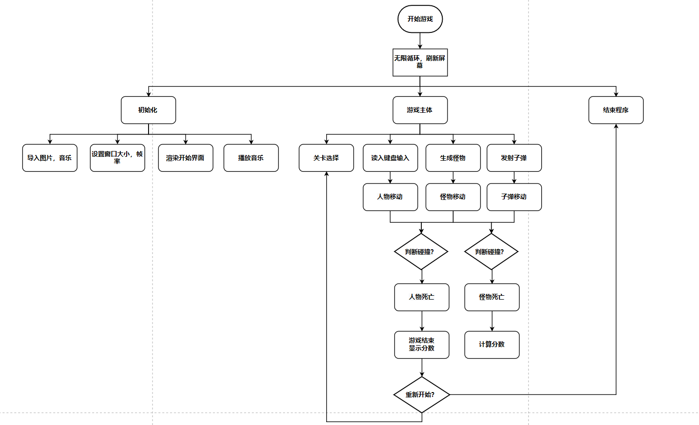

# kingdom defender
## 设计理念
本程序的目标即实现一个横版闯关的小游戏，共设计了三关，每一关都有不同的地图，不同的怪物来供玩家攻克。怪物的刷新和行为都是随机的，并且随着关卡的提高，难度也提高，相应的，击杀一个怪物获得的分数也随即提高。第一关和第二关都有时间限制，避免在低难度下刷分情况的出现。第三关我设计成了无尽模式，也修改了第三关的弹跳逻辑，使之更难，用来给玩家刷高分的机会。
## 代码逻辑
### 本程序使用Python语言，用到的库有 Pygame sys 和 random
### 流程图

### 定义子弹类和子弹刷新位置函数

	class bullet():
	def bulletset(direction):

### 定义怪物类和怪物刷新位置函数

	class insect():
	def insectset(direction):
	
	class dragon():
	def dragonset(direction):
	
	class mouse():
	def mouseset(direction):

### 初始化
窗口大小
游戏名字
加载背景音乐
加载游戏所用图片
设置各关地面及平台数据
设置帧率：

	pygame.init()
	size = width,height = 1600,900
	ground = [height-235,height-245]                                       #初始化
	screen = pygame.display.set_mode(size)
	pygame.display.set_caption("Kingdom Defender")
	pygame.mixer_music.load("赤色要塞.mp3")
	pygame.mixer_music.play()
	startbjimage = pygame.image.load("开始游戏.png")
	startbjimage_1 = pygame.image.load("开始游戏_1.png")
	startbjimagelist = [startbjimage,startbjimage_1]
	game_over = pygame.image.load("游戏结束.png")
	screen.blit(startbjimage,(0,0))
	speed = [0,0]
	on_ground = 1
	start = 0
	chapter = [0,0,0]
	time = 0
	pygame.display.update()
	fps = 300
	fclock = pygame.time.Clock()

### 进入无限循环，渲染每一帧
#### 利用start判断关卡

	if start == 0:
	elif start == 1:
	elif start == 2:
	elif start == 3：

##### start = 0 时为开始界面
清空怪物及子弹列表

初始化分数和时间参数

利用两张不同的背景图交替刷新实现开始界面的动态显示

刷新屏幕

判断键盘输入，空格开始游戏，如输入为退出，关闭游戏
##### start = 1，2，3分别对应第一，二，三关
#### 主角移动
刷新背景图和人物图

接收键盘输入：
左右移动，上跳跃，x发射子弹，ESC退出

游戏采用 `heroimagerect = heroimagerect.move(speed[0],speed[1])` 实现人物的移动，`speed[0]` 和 `speed[1]` 分别代表人物的水平速度和竖直速度。当键盘输入为按下左键或右键时，`speed[0]` 变为 -10 或 +10，`direction` 变为 0 或 1，代表人物的方向，用来判断发射子弹的移动方向。当键盘输入为松开左键或右键时，`speed[0]` 变为 0。当键盘输入为上键时，先通过 `on_ground` 判断是否滞空，如滞空，则跳过这条指令，否则 `speed[1]` 变为 -21。
#### 发射子弹
当键盘输入为 x 时，向 `bulletlist` 列表里添加一个类为`bullet`的元素，同时传递主角的方向参数:
`bulletlist.append(bullet(bulletset(direction),direction))`

利用 `bulletset` 函数确定子弹刷出的位置：

	def bulletset(direction):
	    if direction == 0:
	        return [heroimagerect.left+100,heroimagerect.top+50]
	    elif direction == 1:
	        return [heroimagerect.left-12,heroimagerect.top+50]

对于 `bulletset` 里的每个元素，设置 `bulletexist = 1` ,j将子弹图片填充到子弹的位置 `screen.blit(bulletimage, i.bulletpos)` 
#### 判定怪物死亡
对 `insectlist` `dragonlist` `mouselist` 里的每个元素判定是否与子弹发生碰撞，如碰撞，从列表里删除该元素，同时设置 `bulletexist = 0` .
#### 怪物移动
对 `insectlist` `dragonlist` `mouselist` 里的每个元素的位置进行修改，水平位置按照方向进行改变，竖直速度由 `i.dragonpos[1]+=random.randint(-7,7)` 进行随机改变。

每个怪物移动时的动画都由若干张静态图片交替刷新实现,由 `cmf += 1` `dmf += 1` 和 `mmf +=1` 再取余的方式实现静态图片的交替刷新： 

	screen.blit(dragonimage_left[cmf % 12], i.dragonpos)
#### 判定边界及跳跃
若人物边界越过窗口边界或与跳跃平台发生碰撞，则相应的 `speed[0]` 或 `speed[1]` 变为 0 。

若主角在滞空条件下，则每帧 `speed[1] += 1` ,通过加速度实现跳跃的效果。
#### 判定死亡
若人物边界与怪物边界发生碰撞，则进入 `GAME OVER` 界面循环，刷新背景图片为游戏结束背景图同时显示分数。

接收键盘输入

若输入为退出，则关闭游戏

若输入为空格，则跳出死亡循环，重新进入游戏循环：

	while True:                     #撞虫子
	    end_score = font.render(grade, True, (255, 255, 255))
	    screen.blit(game_over,(0,0))
	    screen.blit(end_score, (700, 450))
	    pygame.display.update()
	    for event in pygame.event.get():
	        if event.type == pygame.QUIT:
	            sys.exit()
	        elif event.type == pygame.KEYDOWN:
	            if event.key == pygame.K_ESCAPE:
	                sys.exit()
	            elif event.key == pygame.K_SPACE:
	                start = 0
	    if start == 0:
	        speed = [0, 0]
	        insectlist.clear()
	        dragonlist.clear()
	        bulletlist.clear()
	        break

#### 判定时间
若时间超过预设时间，则修改 start 的值，进入下一关：

	if time >= 1000:
	    time = 0
	    start = 2
	    insectlist.clear()
	    dragonlist.clear()
	    bulletlist.clear()
	    screen.blit(second_level,(0,0))
	    pygame.display.update()
	    pygame.time.delay(2500)

#### 渲染一帧
刷新背景图，将主角图片填充到主角位置上，显示分数与时间，进入下一帧循环
## 遇到问题
由于每一关怪物较多，在刷新屏幕时帧率不是特别高
## 收获
为了完成这个小游戏，自学 Pygame，掌握了一门新的语言，同时获得了第一次独立开发程序的经历。但是对程序开发流程不熟悉，开发进度慢，需要在今后的教学和自学中逐渐掌握。
## 课程总结
我是抱着学语言的目的选的这门课，一学期下来，我认为达到了目标，老师讲的很系统，本来一直对python的数据结构搞不懂，和c有挺大区别，但是有一节老师讲了列表，MAP之后，豁然开朗，非常感谢老师。
作业安排也合适，把上课的内容做巩固，又不会太难，在老师的帮助下，知识系统建立起来了，有了解了很多第三方库，会把这门课推挤给同学！